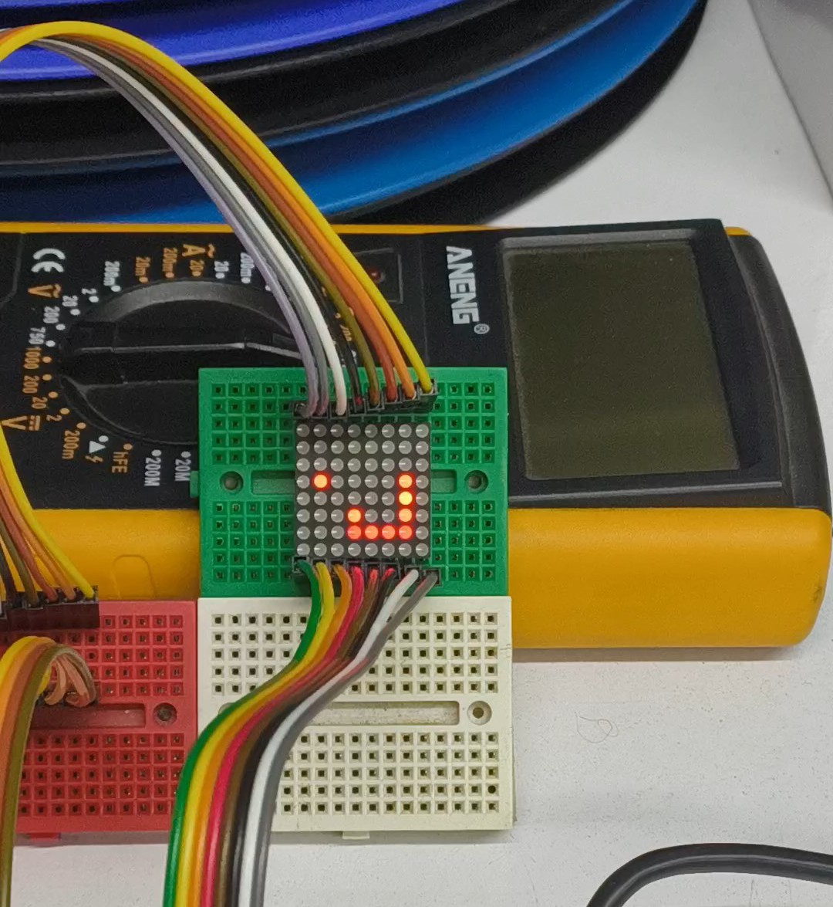

## snake_on_hardware
This project is an implementation of the old snake game, the whole code of it is written in Verilog so basically the game is just hardware acting like software.
<!--  -->

### Game logic:
the logic that i used is fairly simple : 
- the only thing that needs to be calculated is the snake head. the direction module tells the snake module the direction that the snake will go in the next move, and the snake module calculates the new snake-head position!
- every time this calculation needs to be done, the function (death_check) runs to check if the snake dies or not!
- the death checking and move logic waits for the counter that sets the game's speed.
- the food positioning system runs between the game speed counter is being counted, and at its worst case scenario it needs about 64 cycles to find a random empty place to put the food for the snake to eat! 
---

### Score Sequencer
when snake dies a score sequencing system runs and shows the score of that run to the player in series!
for example : score = (36) ---> the score sequence: (3-6-!-3-6-!-3-6-!-!-!) and repeats from the beginning.
---

### Display
the display is an 8*8 dotmatrix, that its column are anodes and the rows are cathodes.
it has scan time of 2000 cycles of a 100Mhz clock , so there is no flickering!
the display is multiplexed between the game logic and the score sequencing system!
---